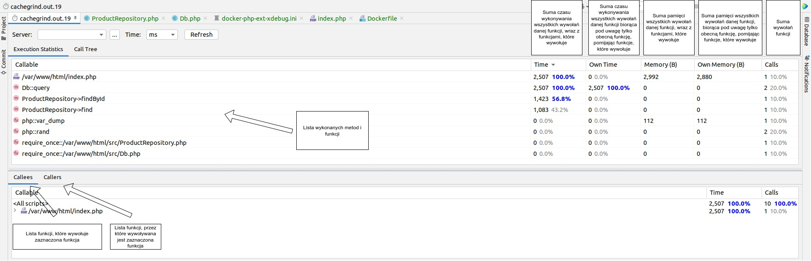

# Szkolenie z odczytu cachegrind i podstawowej konfiguracji profilera Xdebug

## Odnośniki

1. [Najczęstsze problemy wydajnościowe napotykane w sklepach internetowych opartych na popularnych silnikach (Magento, Prestashop) i nie tylko](Problemy.md).
2. [Szkolenie wideo](https://drive.google.com/file/d/1vSMVcS80Ka7yFp8AhPeXxOLXBt0NzrWm/view?usp=sharing).
3. [Scenariusz szkolenia](https://docs.google.com/document/d/1JFirVFB2Ac7ks10-3FKzY8KVNC2TUl4cYhmvl0Ztp9k/edit?usp=sharing)
4. [Hasło do pliku wynikowego profilera real-life-project.xt.zip](https://docs.google.com/spreadsheets/d/14TmltLZO0lqKgrmU_CY49DFZNrQjot1u2cLceZIwosY/edit#gid=0&range=I12).

## Uruchomienie projektu

```shell
docker compose up -d
```

## Ściągawka z programu odczytującego cachegrind


